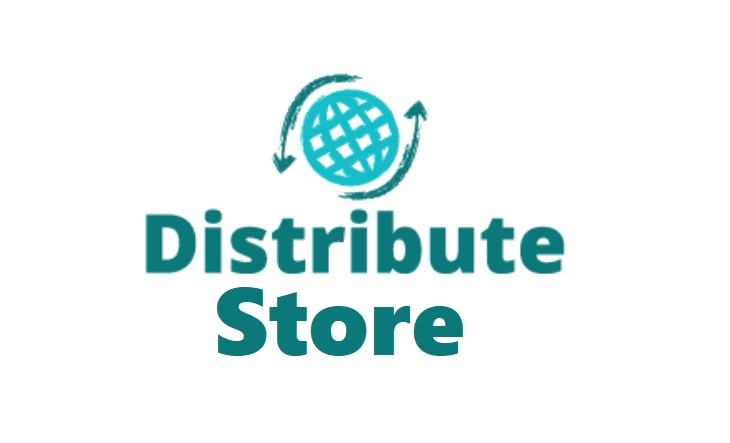

<h1 align="center"></h1>


# Prática 4 (Sistemas Distribuidos)
> 

<h1 align="center">


</h1>
<hr>


## Instalação

Para instalar a aplicação na sua máquina, siga os seguintes passos: 

### Clonando o repositorio

```git init
git clone https://github.com/DanielCabral/Pratica-Offline-4---Sistemas-Distribuidos.git
`
## Exemplo de uso


## Resultados
### Aplicação Web - Cadastro de pontos de coleta

<h1 align="center">
    
</h1>


## Historico de versões

* 0.0.1
    * Em progresso

## Meta

Daniel Cabral de Souza – [@DanielC14601541](https://twitter.com/DanielC14601541) 
Esse projeto está sob a licença MIT. Veja o arquivo [LICENSE](LICENSE.md) para mais detalhes.

[https://github.com/DanielCabral/Next-Level-Week-1](https://github.com/DanielCabral/)

## Como contribuir

1. Faça um Fork desse repositório (<https://github.com/DanielCabral/Next-Level-Week-1/fork>)
2. Crie uma branch com a sua feature: `git checkout -b my-feature`
3. Commit suas mudanças: `git commit -m 'feat: My new feature'`
4.  Push a sua branch: `git push origin my-feature`
5. Crie um novo Pull Request

